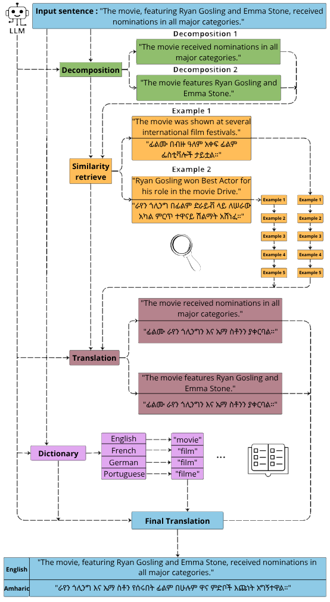

SCaMD (Similarity Chain-across-Multilingual Dictionaries) is a LLM-based framework exploring the combination of compositional-translation and the usage of self-generated dictionaries in the field of low-resource languages machine translation.

We use CompTra code : https://github.com/ArmelRandy/compositional-translation.git
Related with their study https://arxiv.org/abs/2503.04554

SCaMD pipeline:

The following command applies $SCaMD-Core$ on flores200 dataset from English to Amharic with LLaMA 3.1 8B Instruct and save the results in a file: "SCaMD-Core/flores-English-Amharic-generations.jsonl".

python -m scamd_sampler\
    --src "eng_Latn"\                        # Source language (e.g., English)
    --tgt "amh_Ethi"\                       # Target language (e.g., Amharic)
    --k 5\                                # Number of nearest examples to retrieve
    --CodLangs "["French","German","Portuguese"]"\  # Languages to build multilingual dictionaries
    --ds "flores"\                          # Dataset name or path
    --checkpoint 0\                       # Start index in the dataset
    --path_output "SCaMD-Core"\            # Output directory for generations
    --nb 100\                             # Number of sentences to generate (None = all)
    --comptra True\                       # Whether to run compositional translation
    --scamd True\                         # Whether to run dictionary generation (SCaMD)
    --prompts_path None\                  # Reuse saved prompts (None = regenerate) -> Example: "flores-Compositional-translation-Amharic"
    --outPrompts False\                   # Output the prompts to file (without translation)
    --dictionaries_path None\             # Reuse saved dictionaries (None = regenerate) -> Example: "flores-Dictionaries-(English-French-German-Portuguese)"
    --outCod False\                       # Output the dictionaries to file (without generation)
    --filterSize 40\                      # Max word window repetition filter
    --filterChrSize 5\                    # Max character window repetition filter
    --nameMode False\                     # Tag proper names with (PROPER_NAME)
    --mode True\                          # Wrap dictionary words with quotes
    --size 1\                             # Minimum word size in dictionary
    --adapting True\                      # Gradually adapt word size to reach goal
    --goalSize 40\                        # Target dictionary size
    --place "before"\                     # Dictionary placement in the prompt
    --filter True                         # Apply final filtering to output

If you have any question don't hesitate contacting me at augustinsamier@gmail.com